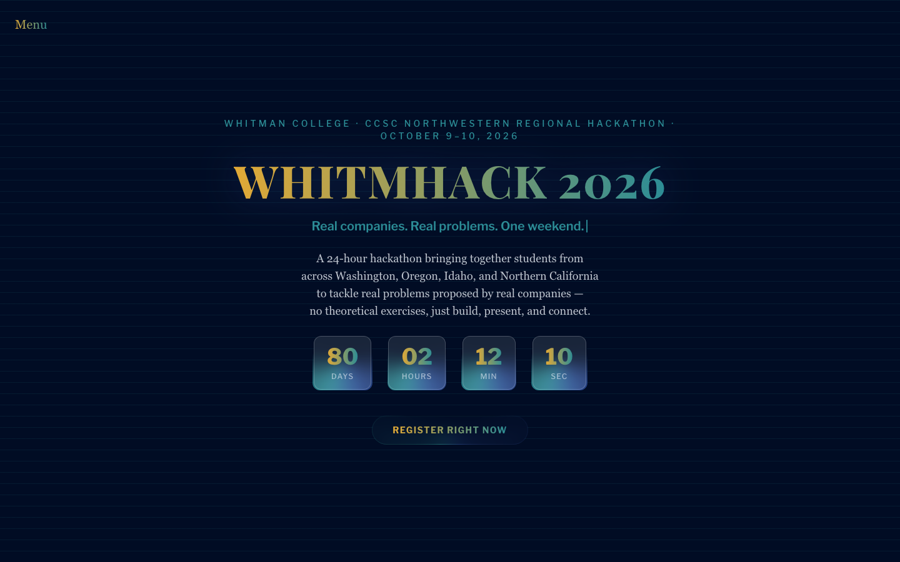
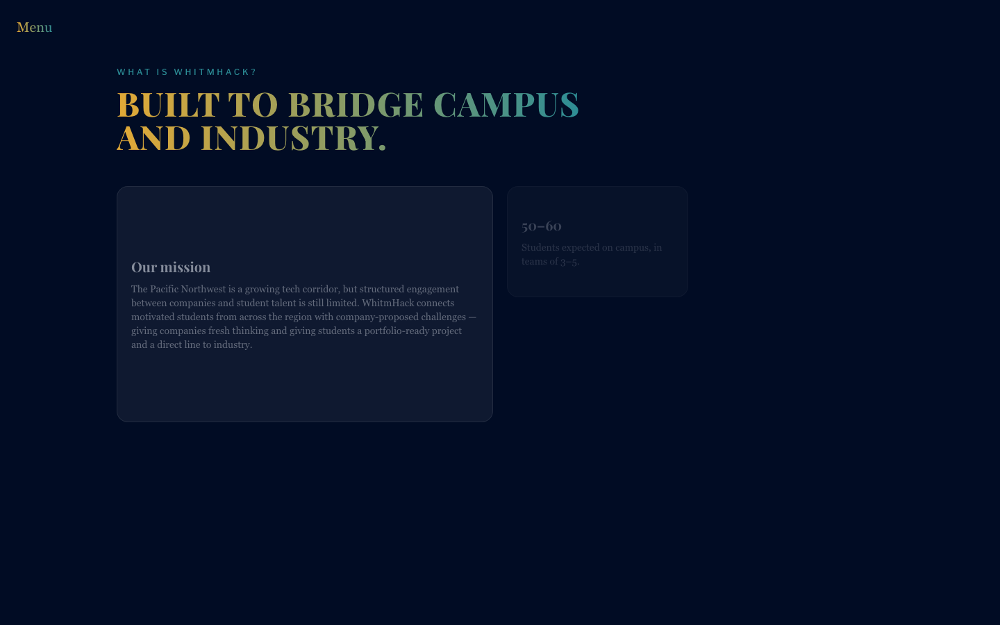
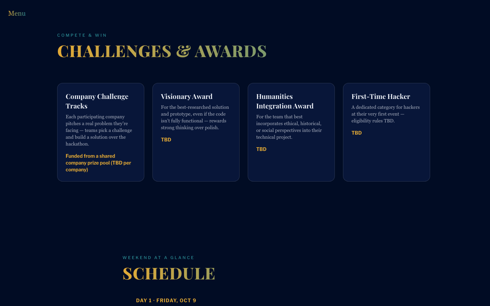
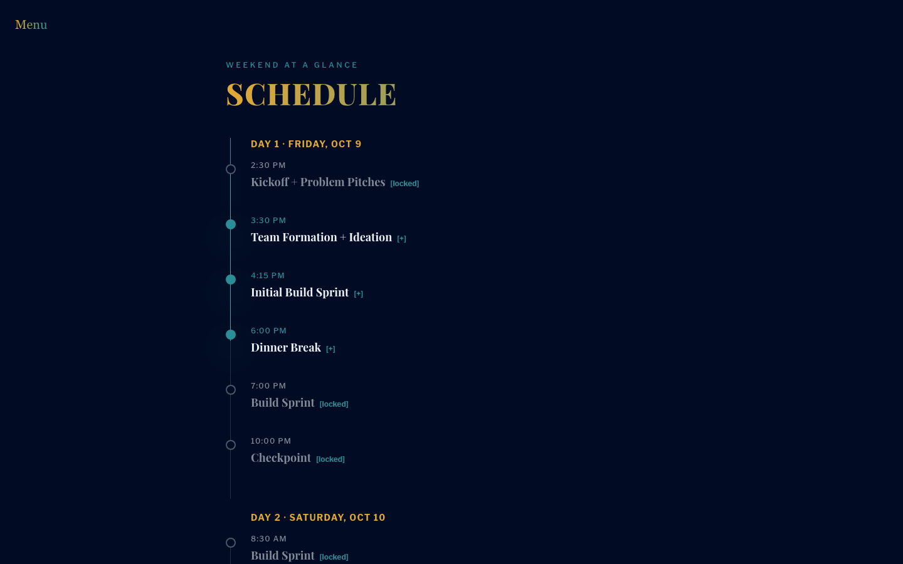
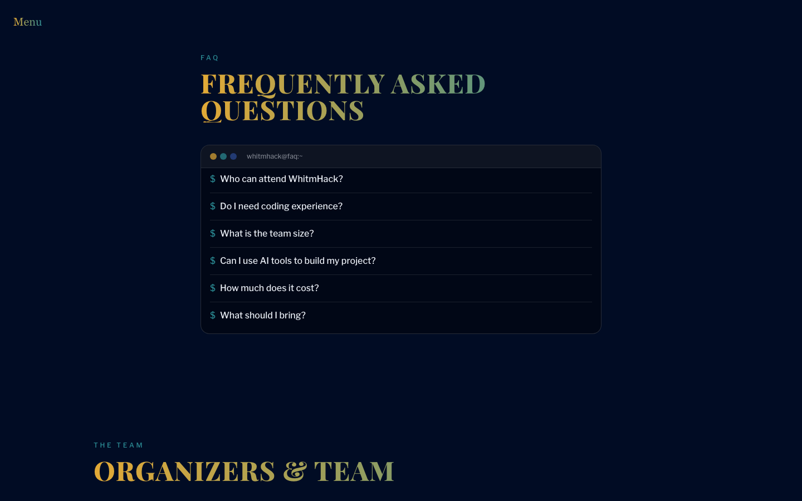
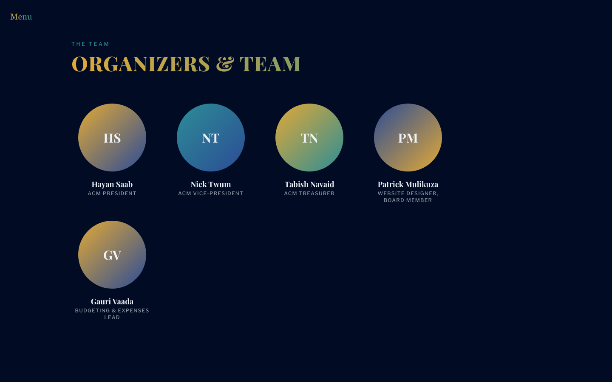
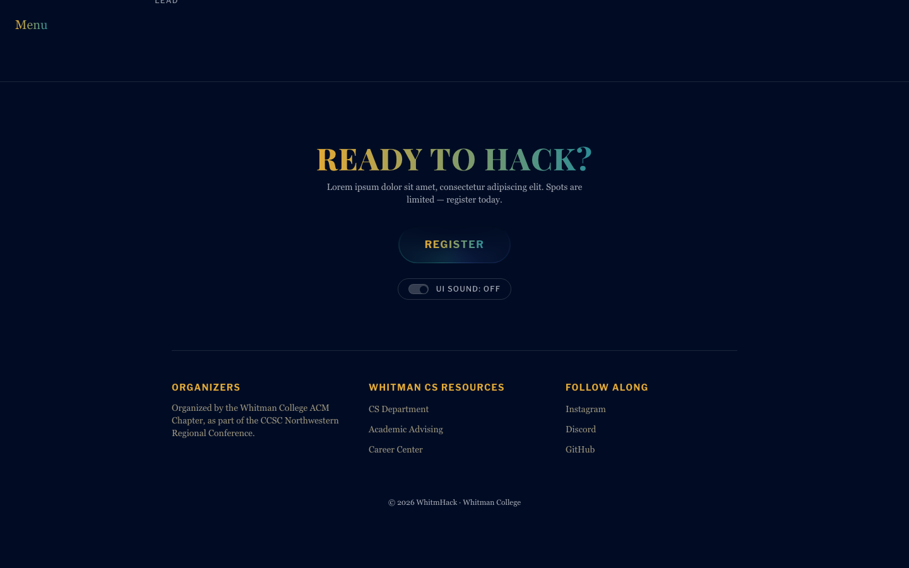

# WhitmHack Website

The official website for **WhitmHack**, Whitman College's student
hackathon. I implemented a hero with a live countdown and a Matrix-style digital rain
background, an about section, tracks & prizes, a scroll-driven schedule,
a terminal-style FAQ, an organizers/team section, and a registration
footer.

> **Content status:** most section copy is the real thing, sourced from
> the ACM Whitman Hackathon planning docs. A handful of specifics
> (per-track prize amounts, one FAQ answer) are still undecided
> and marked with `TBD` comments and will be updated soon. See
> [Filling in real content](#filling-in-real-content) below.

## Screenshots

| Hero | About |
| --- | --- |
|  |  |

| Tracks & prizes | Schedule |
| --- | --- |
|  |  |

| FAQ | Organizers & team |
| --- | --- |
|  |  |

| Footer / registration |
| --- |
|  |

## Tech stack

- **React 19** via **Vite**
- **Tailwind CSS 3** with a custom theme (`tailwind.config.js`) — see
  [Design system](#design-system)
- **Framer Motion** for UI/scroll animation
- Hero background is a plain HTML5 Canvas 2D effect (`MatrixRain.jsx`),
  no WebGL or 3D library involved
- **Vitest** + **React Testing Library** for unit/component tests,
  **Playwright** (+ `@axe-core/playwright`) for end-to-end and
  accessibility tests
- **GitHub Actions** for CI (`.github/workflows/test.yml`)

## Getting started

Requires [Node.js](https://nodejs.org/) 20+.

```bash
# 1. Clone the repo
git clone <repo-url>
cd whitmhack-site

# 2. Install dependencies
npm install

# 3. Run the dev server (http://localhost:5173)
npm run dev
```

## Available scripts

| Command                 | What it does                                                |
| ----------------------- | ----------------------------------------------------------- |
| `npm run dev`           | Start the Vite dev server with hot reload                   |
| `npm run build`         | Build the production bundle into `dist/`                    |
| `npm run preview`       | Serve the production build locally, to sanity-check it      |
| `npm run test`          | Run the Vitest unit/component test suite once               |
| `npm run test:watch`    | Run Vitest in watch mode while developing                   |
| `npm run test:coverage` | Run unit tests with a coverage report                       |
| `npm run test:e2e`      | Run the Playwright end-to-end suite (builds + serves first) |
| `npm run test:e2e:ui`   | Run Playwright in interactive UI mode                       |
| `npm run lint`          | Run Oxlint                                                  |

The first time you run `npm run test:e2e`, install the Playwright browser
binary if you haven't already:

```bash
npx playwright install --with-deps chromium
```

## Project structure

```
whitmhack-site/
├── .github/workflows/test.yml   # CI: unit tests, production build, e2e tests
├── e2e/                         # Playwright end-to-end specs
├── public/                      # Static assets served as-is
├── src/
│   ├── components/              # One file per section/UI piece, each with a co-located *.test.jsx
│   ├── data/siteContent.js      # All page copy, data-driven — see "Filling in real content"
│   ├── hooks/                   # Shared hooks (e.g. usePrefersReducedMotion)
│   ├── lib/                     # Pure, DOM-free logic (countdown, tilt, typewriter, WebGL helpers, etc.)
│   ├── test/setup.js            # Vitest environment setup (jsdom API polyfills)
│   ├── App.jsx                  # Assembles the page from section components
│   └── main.jsx                 # React entry point
├── tailwind.config.js           # Design system: colors, fonts, shadows
├── playwright.config.js
└── vite.config.js               # Includes the Vitest `test` configuration
```

## Design system: "Electric Wheat & Cyber Sky"

Defined in `tailwind.config.js` and used via Tailwind utility classes
(`bg-deep-space`, `text-electric-wheat`, `font-heading`, etc.). The three
accent colors were originally full-saturation neon (`#004BFF`, `#00F5FF`,
unmuted `#FFC627`) — they've since been deepened/desaturated (blue and
teal) or slightly warmed (wheat) to read as more elegant and less
"arcade," while keeping the same three hue families so the brand is still
recognizable. Two muted neutrals were added alongside them for
secondary/inactive content that shouldn't compete with the accents.

A handful of canvas/WebGL-driven effects (`MatrixRain.jsx`,
`LiquidAvatar.jsx`, `RippleText.jsx`'s texture drawing, the
`EdgeLightFrame.jsx` conic-gradient) can't reference Tailwind classes —
canvas `fillStyle`/CSS custom-property values need real color strings —
so those few files keep their own hardcoded copies of these hex values in
sync by hand instead.

| Token            | Hex       | Use                                        |
| ---------------- | --------- | ------------------------------------------ |
| `deep-space`     | `#010C24` | Background                                 |
| `silicon-blue`   | `#0A193F` | Cards / panels                             |
| `cyber-blue`     | `#2C4C96` | Primary accent / brand                     |
| `electric-wheat` | `#E2A936` | Secondary accent, CTAs/highlights          |
| `laser-teal`     | `#2C8D96` | Supporting accent, active states           |
| `walla-mist`     | `#EFF2F9` | Body text on dark backgrounds              |
| `parchment`      | `#C7BA97` | Warm muted neutral — secondary footer text |
| `slate-mist`     | `#7A84A3` | Cool muted neutral — inactive nav titles   |

**Fonts** — an authoritative, editorial/newspaper pairing:

| Utility        | Typeface(s)                                               | Use                                                                                                                        |
| -------------- | --------------------------------------------------------- | -------------------------------------------------------------------------------------------------------------------------- |
| `font-heading` | Playfair Display (Georgia, serif fallback)                | Headlines (h1–h4)                                                                                                          |
| `font-subhead` | Libre Franklin (Franklin Gothic Medium, Arial, Helvetica) | Sub-headlines, eyebrows/kickers, labels, buttons                                                                           |
| `font-body`    | Georgia (Times New Roman fallback)                        | Body copy — set as the page default                                                                                        |
| `font-mono`    | system monospace stack                                    | Reserved for one decorative accent only (the "falling code" effect behind hovered track cards) — not used for real content |

## Filling in real content

There are two ways to edit page copy, and they don't overwrite each
other:

- **Before launch / no backend running:** edit
  [`src/data/siteContent.js`](./src/data/siteContent.js) directly and
  rebuild. Search it for `TBD` comments — each one marks a handful of
  specifics (per-track prize amounts, the registration link, one FAQ
  answer) that aren't locked in yet by the planning docs. See
  [`MAINTENANCE.md`](./MAINTENANCE.md) for a section-by-section
  breakdown of what's still open.
- **After launch, with the backend running:** use the
  [admin content editor](#admin-content-editor) below — no rebuild, no
  code changes, and non-technical organizers can do it themselves.

See that section for how the two interact: the live site prefers
whatever's saved in `server/content.json` and only falls back to
`siteContent.js` if the backend is unreachable.

## Admin content editor

A self-hosted, password-protected admin interface lets non-technical
organizers edit every text string on the site directly from the browser
without requiring any code changes, or third-party CMS.

### Architecture

Production runs entirely on Vercel: the React frontend and the admin API
deploy together as one project, with an Upstash Redis store (provisioned
through the Vercel Marketplace) holding the saved content. There's no
separate server to keep running.

- **API** (`api/`): Vercel serverless functions, not a long-running
  Express process. `api/login.js` checks the password (bcrypt) and issues
  a short-lived JWT (2-hour expiry); `api/content.js` serves the saved
  content publicly (`GET`) and accepts writes only with a valid
  `Authorization: Bearer <token>` header (`POST`). Both read shared
  helpers from `api/_lib/` (`auth.js`, `redis.js`, `rateLimit.js`).
  Login is rate limited (10 attempts / 15 min, keyed per IP) using a
  Redis counter — an in-memory limiter wouldn't work here since
  serverless functions don't share memory between invocations.
- **Live content** (`src/context/ContentContext.jsx`): every public
  section reads its copy through a `useContent(key)` hook instead of
  importing `siteContent.js` directly. On load it fetches `/api/content`
  and swaps in whatever's been saved through the admin dashboard; if the
  API isn't reachable (static hosting, or Redis isn't configured yet) it
  silently falls back to the bundled `siteContent.js` defaults. This is
  what makes admin edits show up on the live site without a rebuild.
- **Frontend auth** (`src/context/AdminContext.jsx`): manages auth state
  and provides `login`, `logout`, `fetchContent`, and `saveContent`
  helpers.
- **Inline editor** (`src/components/EditableText.jsx`): toggles text
  into an editable input when the admin is logged in, styled to match the
  site's typography exactly (dashed red border is the only visual cue).
- **Dashboard** (`src/components/AdminDashboard.jsx`): a collapsible,
  section-by-section editing UI at `/admin/dashboard`. Redirects to the
  login page if you're not authenticated — the edit UI is never shown
  without a valid token. Card-style lists (About's bento cards, Tracks,
  FAQ questions, Organizers, and the Footer's resource/social links) can
  each be added to or removed from directly in the dashboard, not just
  edited in place — removing asks for confirmation since it can't be
  undone once saved.
- **Login page** (`src/components/AdminLogin.jsx`): a clean password
  prompt at `/admin`, styled with the same design system.

`server/` is a leftover standalone Express version of the same API,
reading/writing a local `content.json` file. It still works if you want
to run something fully self-contained on your own machine without the
Vercel CLI, but it isn't what production uses, and file-based storage
doesn't work on Vercel's serverless functions (their filesystem is
read-only/ephemeral) — that's exactly why the API moved to `api/` +
Redis. Safe to delete once you've confirmed the new setup works for you.

### Local setup

Install the Vercel CLI once (`npm install -g vercel`), then from the
project root:

```sh
vercel link      # connects this folder to your Vercel project
vercel env pull  # downloads JWT_SECRET / ADMIN_PASSWORD_HASH / Redis vars into .env.local
vercel dev       # runs the frontend AND api/ together, matching production
```

`vercel dev` serves everything on one port (usually `http://localhost:3000`)
— visit `/admin` there, log in, and edit. This only works after you've
deployed once and set the environment variables (see **Deploying**
below); until then, `npm run dev` still runs the frontend fine on its
own, just without a working admin panel (it'll fall back to the bundled
content, same as always).

### Security notes

- The admin token expires after 2 hours — re-login is required after that.
- The API only accepts writes from requests with a valid JWT in the
  `Authorization: Bearer <token>` header.
- Login is rate limited (10 attempts / 15 min / IP) to slow down password
  guessing.
- `.env` (and any `.env.*` variant) is gitignored — only `.env.example`
  files are tracked. Never commit real credentials. On Vercel, secrets
  live in the project's Environment Variables settings instead of a file.
- The Redis store is what the live site actually renders (via
  `ContentContext`'s fetch) — `siteContent.js` is only the build-time
  fallback shown until the first admin save.

## Deploying (GitHub + Vercel)

This gets the site on GitHub and live on Vercel, with the admin dashboard
fully working (saves persist to Redis) so any teammate with the site URL
and password can edit content — no local setup required on their end.

### 1. Push the code to GitHub

In VS Code's integrated terminal (`` Ctrl+` `` / `` Cmd+` ``), from the
project root:

```sh
git init
git add .
git commit -m "Initial commit"
```

Then create the actual repository on GitHub: go to
[github.com/new](https://github.com/new), name it (e.g. `whitmhack-site`),
leave it empty (don't add a README/gitignore/license there), and click
**Create repository**. GitHub then shows you a remote URL — copy it and
run:

```sh
git remote add origin <the URL GitHub gave you>
git branch -M main
git push -u origin main
```

Refresh the GitHub page — your code should be there.

### 2. Deploy to Vercel

1. Go to [vercel.com](https://vercel.com) and sign up/log in with your
   GitHub account.
2. Click **Add New → Project**, find `whitmhack-site` in the list, and
   click **Import**. Vercel auto-detects it as a Vite project — leave the
   build settings as-is and click **Deploy**.
3. It'll deploy successfully, but the admin panel won't work yet — you
   still need Redis and your secrets (next steps).

### 3. Add a Redis store

1. In the Vercel dashboard, open your project → **Storage** tab →
   **Create Database**.
2. Choose **Upstash** → **Redis**, give it a name, and connect it to this
   project. Vercel automatically adds the Redis connection as environment
   variables — you don't need to copy anything yourself.

### 4. Set your admin credentials

Still in the Vercel dashboard: **Settings → Environment Variables**. Add
two:

- `JWT_SECRET` — generate one locally:
  ```sh
  node -e "console.log(require('crypto').randomBytes(32).toString('hex'))"
  ```
- `ADMIN_PASSWORD_HASH` — generate a hash of whatever password you want
  the admin login to use:
  ```sh
  node -e "console.log(require('bcryptjs').hashSync('YOUR_CHOSEN_PASSWORD', 10))"
  ```

Paste each generated value in as its own environment variable (apply to
all environments — Production, Preview, Development). Then go to the
**Deployments** tab and redeploy (or just push any small commit — Vercel
redeploys automatically on every push to `main`).

### 5. Try it

Visit your deployed URL (Vercel gives you one like
`whitmhack-site.vercel.app`), go to `/admin`, and log in with the
password you picked in step 4. Edits saved there now persist in Redis and
show up for every visitor — including teammates, who just need the URL
and password, nothing installed.

### Letting teammates help

- **To edit content** (organizers, tracks, FAQ, etc.): just share the
  deployed URL and the admin password. That's it — no GitHub or Vercel
  account needed.
- **To edit code**: add them as collaborators on the GitHub repo
  (**Settings → Collaborators** on the repo page). Every push to `main`
  redeploys automatically; every pull request gets its own preview
  deployment on Vercel.

## Testing

- **Unit/component tests** (`src/**/*.test.{js,jsx}`) run in `jsdom` via
  Vitest. Browser APIs jsdom doesn't implement (`IntersectionObserver`,
  `matchMedia`, `ResizeObserver`) are polyfilled in `src/test/setup.js`.
- **End-to-end tests** (`e2e/*.spec.js`) run against a real, built
  production bundle in headless Chromium via Playwright, including a
  full user-journey test and an automated accessibility audit
  (`@axe-core/playwright`).

CI (`.github/workflows/test.yml`) runs all of the above — unit tests, a
production build, and the Playwright suite — on every push and pull
request against `main`.

## Accessibility & performance notes

- Every animated section respects `prefers-reduced-motion` (global
  Framer Motion config plus manual fallbacks for the matrix rain canvas
  and the FAQ text-scramble effect).
- The whole page passes an automated `axe-core` audit and is fully
  operable by keyboard alone (see `e2e/accessibility.spec.js`).
- The hero background used to be a WebGL particle field (Three.js +
  React Three Fiber), which added roughly 900KB to the JS bundle. It's
  since been replaced with a plain Canvas 2D effect (`MatrixRain.jsx`),
  and those dependencies were removed entirely — the whole app now
  ships as a single ~377KB chunk with no bundle-size warnings.

## Navigation

`SpineNav.jsx` is hidden by default. The only thing on screen at any
scroll position, on every viewport size, is a small "Menu" label fixed to
the top-left corner. Clicking it reveals every section title as one
block — horizontal text, anchored to the far left, vertically centered
as a group — and clicking it again (it becomes "Close") hides it. The
active section is still tracked continuously via `IntersectionObserver`
even while the panel is closed, so whichever title is highlighted is
already correct the moment it's opened. Clicking a title closes the
panel and scrolls to that section (explicitly, via `scrollIntoView` —
not the anchor's own default behavior, since closing the panel unmounts
the link in the same tick and that race can silently eat the scroll).

Both the trigger label and every title in the revealed block "emerge"
using the same liquid-distortion technique as `LiquidAvatar.jsx`'s
team-photo hover effect — see `RippleText.jsx`, which reuses that exact
WebGL shader (compiled via `src/lib/webgl.js`), but centers the ripple
and drives its strength from a settle-over-time animation instead of
cursor position. Titles are staggered (90ms apart) so they settle into
place one after another instead of all at once, and the trigger label
ripples again on every click since its own text flips between
"Menu"/"Close", which re-triggers the same reveal animation. Falls back
to plain, instantly-visible text under `prefers-reduced-motion`, same as
every other WebGL/canvas effect on this site.

## Micro-interactions

- **Matrix digital rain** (hero background) — falling 0/1 characters on
  a plain `<canvas>`, kept at 14% CSS opacity so the streams read as a
  clearly-visible texture without ever competing with foreground text —
  verified by the automated contrast audit, not by eye
  (`src/components/MatrixRain.jsx`). Each stream flashes brighter
  (0.6–0.7 alpha) the instant it spawns, then cools to its settled
  baseline.
- **3D cursor-tilt cards** (About section bento grid) — pointer position
  within a card drives real rotateX/rotateY via `src/lib/tilt.js`
  (`computeTiltRotation`, unit tested) + a Framer Motion spring.
- **Animated gradient headlines** — `.text-gradient-shift` in
  `src/index.css` (hero title + every major section heading).
- **Tactile CTA buttons** — layered box-shadow that shrinks on `:active`
  (Register buttons in the hero and footer).
- **Asymmetric scroll parallax** (Schedule section) — each row's time
  label and title/details block ride that row's own scroll transit at two
  different rates via `useScroll`/`useTransform`, for a subtle depth
  illusion (`ScheduleSection.jsx`).
- **Glitch hover effect** (Register buttons, track card headers/descriptions)
  — a reusable `GlitchText` component (`src/components/GlitchText.jsx`)
  slices two recolored copies of the text via `clip-path`, driven by the
  same JS-tracked hover/focus state already used elsewhere, not raw
  `:hover` (`.glitch-text` in `src/index.css`).
- **Glass + spinning edge-light + gradient text** (Register buttons,
  countdown boxes) — a 3-layer stack: `EdgeLightFrame.jsx` renders a
  clipping wrapper plus a tight, un-blurred spinning conic-gradient ring
  behind the content (`animate-border-spin`); the interactive element
  itself sits on top with a frosted-glass background
  (`.glass-core`/`.glass-core-light`, with an `@supports` fallback to a
  near-opaque background for browsers without `backdrop-filter`); its
  text is clipped to a slowly animating linear gradient
  (`.text-flow-wheat` + `animate-text-flow`). Both custom animations are
  registered in `tailwind.config.js`.
- **Liquid-distortion text reveal** (the "Menu" trigger and every title
  in the nav panel) — see [Navigation](#navigation) above; `RippleText.jsx`
  reuses `LiquidAvatar.jsx`'s WebGL shader for a settle-into-place ripple
  instead of a hover effect.
- **WebGL liquid-distortion avatars** (Organizers & Team section) — a
  hand-written WebGL shader (no Three.js) ripples each placeholder team
  photo around the cursor (`src/components/LiquidAvatar.jsx`); the
  placeholder "photo" itself (gradient + initials) is generated on a 2D
  canvas and uploaded as the WebGL texture.
- **UI sounds, matched per effect** — synthesized via the Web Audio API
  (`src/lib/uiSounds.js`, no audio assets needed: tones are frequency
  sweeps, textures are filtered white-noise bursts), gated by a footer
  toggle (`SoundContext`/`SoundToggle`) that defaults to **off** and
  persists to `localStorage`. Each hover/animation effect gets its own
  sound rather than one generic click: a high, quiet tick per character
  as the hero typewriter types/deletes (`TypewriterHeadline.jsx`), a
  two-part "droplet" sweep on liquid-avatar hover (`LiquidAvatar.jsx`), a
  filtered-noise "whoosh" on the About bento tilt (`AboutSection.jsx`),
  and a noise-burst-plus-random-blips "signal breaking up" static on the
  Register CTA / track-card glitch hover (`Hero.jsx`, `TracksSection.jsx`).
- **Typewriter subheadline** — cycles through `hero.taglines` forever
  (`src/lib/typewriter.js` is a pure, fully unit-tested state machine;
  `useTypewriter` just drives it on a timer). The animated line is
  `aria-hidden`; a static, visually-hidden paragraph carries the same
  copy once for screen readers.

All of the above fall back to a static/instant state under
`prefers-reduced-motion: reduce`.
